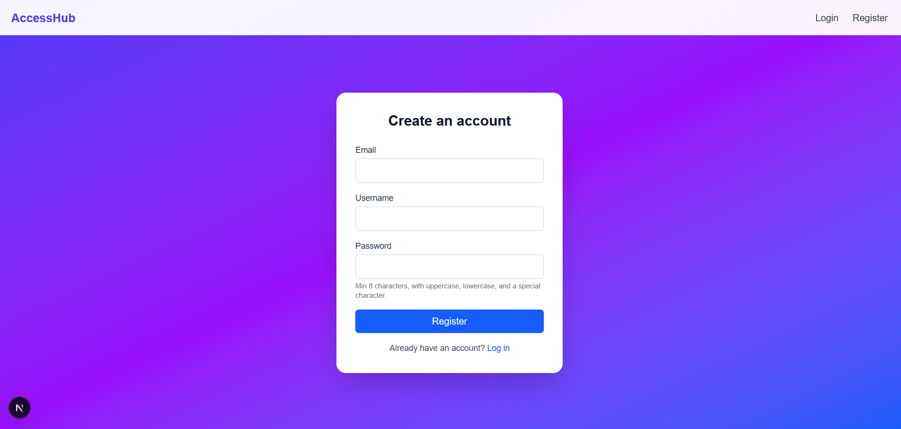
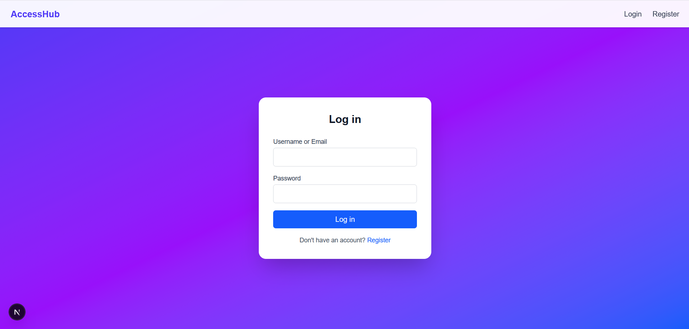
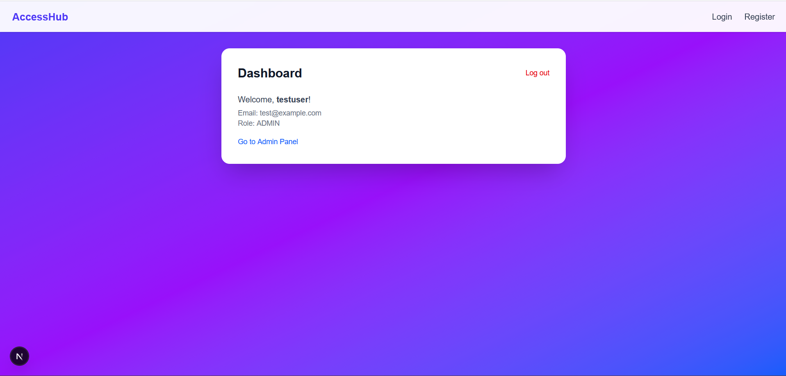
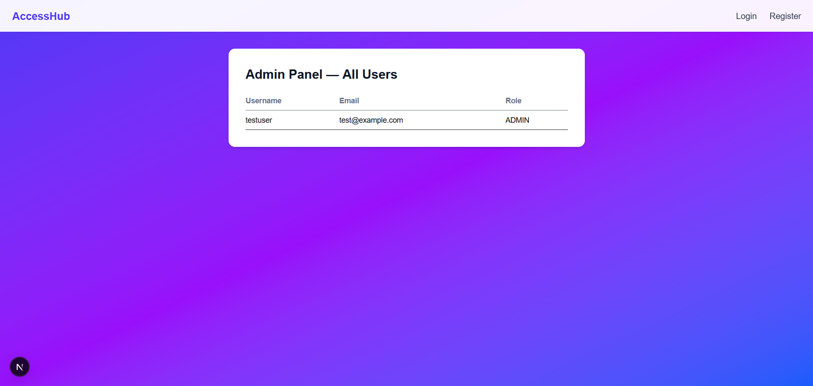

# AccessHub — Authentication System with Role-Based Access Control

AccessHub is a full-stack authentication system built with Next.js, Prisma, and PostgreSQL. It supports user registration, login, and role-based access control (RBAC), distinguishing between regular users and admins.

This project was inspired by traditional PHP-based login systems, reimagined with a modern JavaScript stack, JWT-based authentication, and centralized route protection via middleware.

## Table of Contents
1. Features
2. Tech Stack
3. Instructions to Run the Project
4. Database Setup and Configuration
5. Assumptions
6. Screenshots

## Features

- **User Registration** - Users register with email, username, and password. Passwords are hashed with bcrypt before storage.
- **User Login** - Registered users log in and receive a JWT stored in an httpOnly cookie.
- **Password Validation** - Passwords must contain at least one lowercase letter, one uppercase letter, one special character, and be 8+ characters.
- **Password Strength Indicator** - A live visual indicator guides users toward stronger passwords during registration.
- **Role-Based Access Control (RBAC)** - Users have a role of USER or ADMIN. Admin-only routes and API endpoints are protected centrally via middleware.
- **Error Handling** - Clear error messages for invalid inputs, duplicate emails/usernames, and failed authentication.
- **Session Management** - Authentication persists across page reloads via a signed JWT in an httpOnly cookie.

## Tech Stack

- Frontend and Backend: Next.js (App Router), TypeScript, Tailwind CSS
- Database: PostgreSQL
- ORM: Prisma
- Authentication: JSON Web Tokens (JWT), bcrypt for password hashing

## Instructions to Run the Project

### Prerequisites
- Node.js 20+
- npm

### Steps to Run

1. Clone the repository
   git clone https://github.com/SarasiPerera/accesshub.git
   cd accesshub

2. Install dependencies
   npm install

3. Set up environment variables. Create a .env file in the project root with:
   DATABASE_URL="your-postgres-connection-string"
   JWT_SECRET="a-long-random-secret-string"

4. Run database migrations
   npx prisma migrate dev

5. Start the development server
   npm run dev

6. Access the application at http://localhost:3000

## Database Setup and Configuration

### Schema

The User model is defined in prisma/schema.prisma:

model User {
  id        Int      @id @default(autoincrement())
  email     String   @unique
  username  String   @unique
  password  String
  role      Role     @default(USER)
  createdAt DateTime @default(now())
}

enum Role {
  USER
  ADMIN
}

### Local Development Database

For local development, this project uses Prisma's built-in local Postgres:

npx prisma dev

This starts a local Postgres instance and prints a connection string to use as DATABASE_URL.

## Assumptions

1. Email and Username Uniqueness - Both must be unique across all users.
2. Password Complexity - Enforced both client-side (live indicator) and server-side (validation on the API route).
3. Session Management - Sessions persist via JWT cookie for 24 hours, after which the user must log in again.
4. Role Assignment - New users default to USER role. Promotion to ADMIN is currently done directly in the database.

## Screenshots

### Register

### Login

### Dashboard

### Admin Panel

